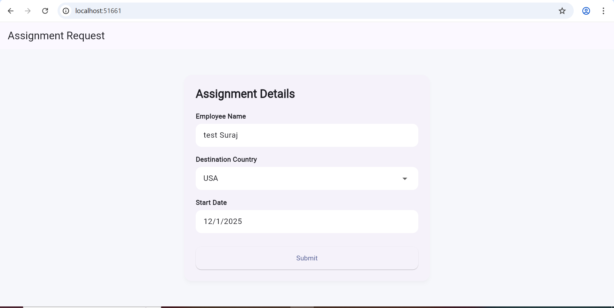
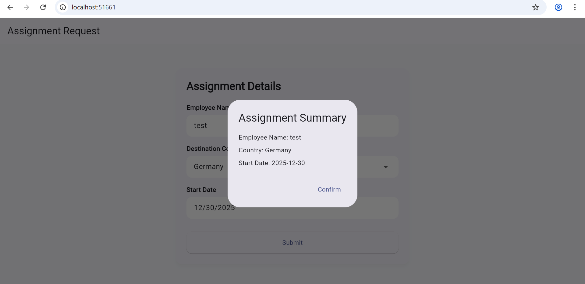
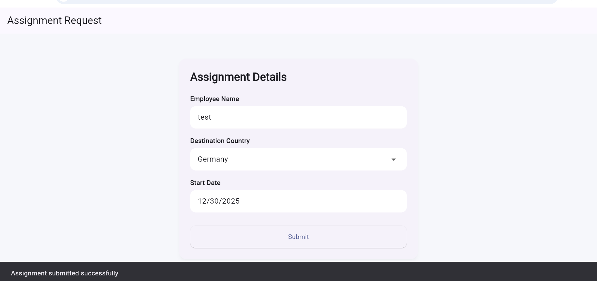

# Assignment Lifecycle – Request Creation & Review

Flutter Web & Android application demonstrating form UI, validation, conditional fields, and mock API integration using Clean Architecture and Riverpod.

## Features
- Assignment request form with validation
- Dynamic country dropdown populated from API
- Conditional Visa Type field (shown only for international destinations)
- Local summary dialog on submit
- Mock API integration for assignment creation
- Responsive UI for Web and Android

## Tech Stack
- Flutter
- Riverpod
- Clean Architecture
- Dio (API integration)

## Mock APIs
- GET `/api/countries` – Fetch countries list
- POST `/api/assignment/create` – Submit assignment request

(Mock APIs implemented using MockAPI.io)

## Run
```bash
flutter pub get
flutter run -d chrome
flutter run -d android


## Screenshots

### Assignment Form


### Summary Dialog


### Success Response
